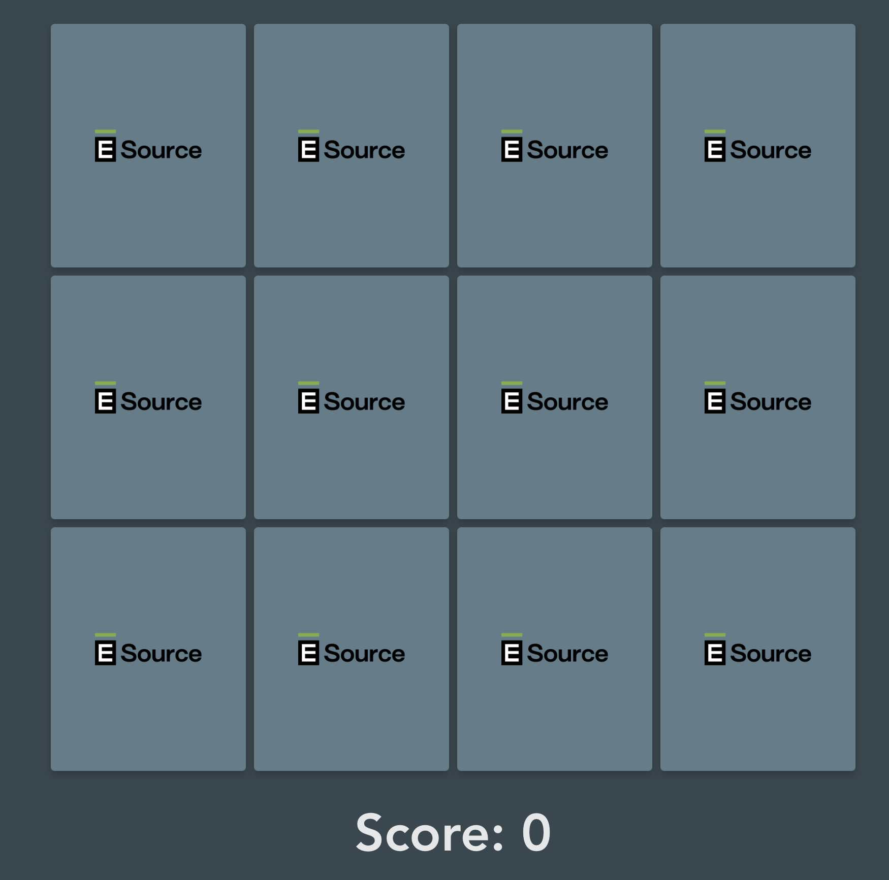
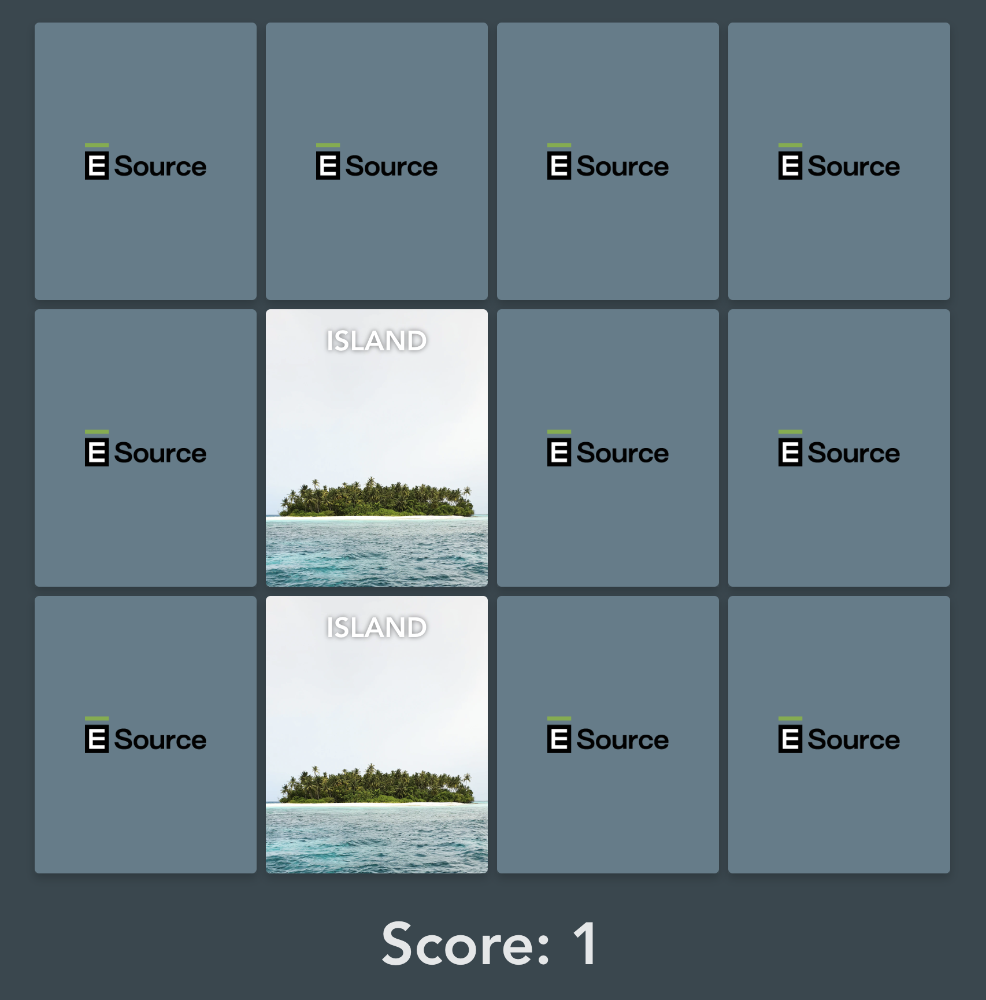

# E Source Frontend Workshop #

If you're reading this, it means you've been invited to participate in the E Source Frontend Workshop. This is a 90 minute workshop where we'll work together through implementing the necessary features for a memory game app.

## Objectives

Your user is someone who wants to play a short memory match game in their downtime. The game should be snappy and simple. Let's walk through some screens:

In the initial view, a user will see a prepopulated set of cards featuring different terrains that can be flipped over. The images of these terrains are all stored in the assets folder. 

When the user flips over a card, the game should check if the first two flipped cards are a match.

If they are, the user should be awarded a point. If not, the cards should flip back over and not award a point.

The game is considered won when all cards are flipped over. At that point, we should replace the score with a message that reads "Congrats You've Won!" 

Once we've reached this point in the development, we'll discuss additional requirements or ideas, improvements, and more.

## Getting Started

1. Clone the project.
2. In the `esource-fe-workshop` folder, run `npm i`
3. Run `npm run dev`

## Other Notes

The recommended Node version for this is 14. If you don't have node installed, you can use [nvm](https://github.com/nvm-sh/nvm) to quickly switch between node versions.

Feel free to ask questions, experiment openly, and google whatever you don't know.